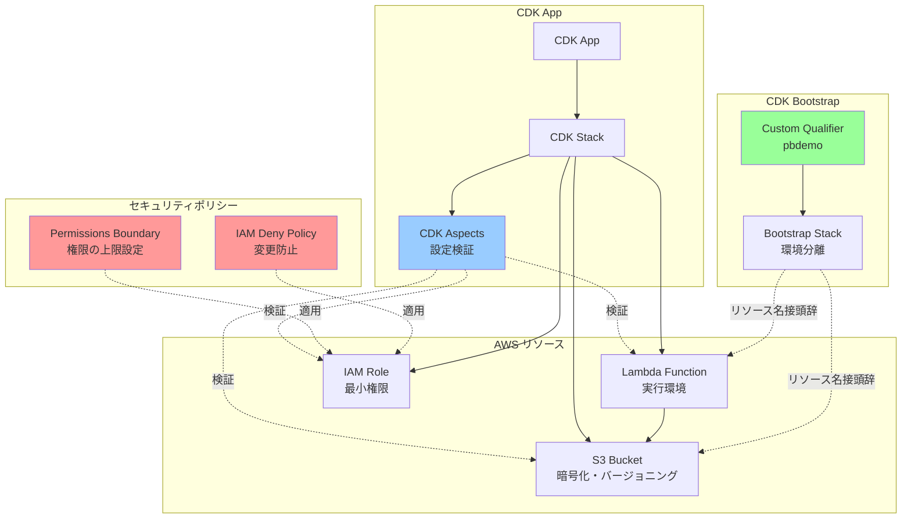

# CDK with Permissions Boundary サンプル実装

このリポジトリは、AWS CDKを使用する際のセキュリティ強化手法を実装したサンプルプロジェクトです。

## 📋 概要

CDKを安全に運用するための4つの主要なセキュリティ機能を実装しています：

1. **Qualifier** - 物理的な場所の分離
2. **Permissions Boundary** - 実行可能な操作の制限
3. **IAM Deny Policy** - 設定変更（脱獄）の防止
4. **CDK Aspects** - 設定ミスの検出と却下

## 🏗️ AWS構成図



### セキュリティレイヤー

```
┌─────────────────────────────────────────────────────┐
│ CDK Aspects (設定ミス検出)                           │
│  ✓ IAMロール検証                                     │
│  ✓ S3セキュリティ検証                                │
│  ✓ ワイルドカード権限の警告                          │
└─────────────────────────────────────────────────────┘
                      ↓
┌─────────────────────────────────────────────────────┐
│ Permissions Boundary (権限の上限)                    │
│  ✓ 許可する操作を明示的に定義                        │
│  ✓ IAM変更操作を拒否                                 │
└─────────────────────────────────────────────────────┘
                      ↓
┌─────────────────────────────────────────────────────┐
│ IAM Deny Policy (脱獄防止)                           │
│  ✓ Permissions Boundaryの削除・変更を拒否           │
│  ✓ セキュリティポリシーの変更を拒否                  │
│  ✓ セキュリティグループの全開放を拒否                │
└─────────────────────────────────────────────────────┘
                      ↓
┌─────────────────────────────────────────────────────┐
│ Qualifier (環境分離)                                 │
│  ✓ カスタムQualifierで異なる環境を分離              │
│  ✓ リソース名の衝突を防止                            │
└─────────────────────────────────────────────────────┘
```

## 🚀 セットアップ手順

### 前提条件

- Node.js 18.x 以上
- AWS CLI 設定済み
- AWS CDK CLI インストール済み

```bash
npm install -g aws-cdk
```

### 1. プロジェクトのクローンとセットアップ

```bash
# リポジトリのクローン
git clone https://github.com/goataka/cdk-with-permissions-boundary.git
cd cdk-with-permissions-boundary/cdk-app

# 依存関係のインストール
npm install
```

### 2. カスタムQualifierでのブートストラップ

**目的**: 環境ごとに異なるQualifierを使用することで、物理的なリソースを分離します。

```bash
# 開発環境用（Qualifier: pbdemo）
cdk bootstrap \
  --qualifier pbdemo \
  --toolkit-stack-name CDKToolkit-pbdemo \
  aws://YOUR_ACCOUNT_ID/YOUR_REGION
```

**設定例**:
- **Qualifier**: `pbdemo` - 開発環境用の識別子
- **Stack Name**: `CDKToolkit-pbdemo` - ブートストラップスタック名

**効果**: 
- S3バケット名: `cdk-pbdemo-assets-{account}-{region}`
- ECRリポジトリ名: `cdk-pbdemo-container-assets-{account}-{region}`
- 他の環境（本番など）と完全に分離

### 3. Permissions Boundaryポリシーの事前作成

**目的**: IAMロールが実行できる操作の上限を設定し、過度な権限付与を防止します。

スタックをデプロイすると、`CDKPermissionsBoundary`というマネージドポリシーが作成されます。このポリシーが、すべてのIAMロールに自動適用されます。

**許可される操作**:
- S3: GetObject, PutObject, DeleteObject, ListBucket
- Lambda: InvokeFunction, GetFunction
- CloudWatch Logs: CreateLogGroup, CreateLogStream, PutLogEvents
- DynamoDB: GetItem, PutItem, UpdateItem, Query, Scan

**拒否される操作**:
- すべてのIAM変更操作（CreatePolicy, AttachRolePolicy等）

### 4. プロジェクトのビルド

```bash
npm run build
```

### 5. CDKスタックの合成とデプロイ

```bash
# CloudFormationテンプレートの生成と検証
cdk synth

# デプロイ
cdk deploy
```

デプロイ時に、CDK Aspectsが自動的に以下をチェックします：
- ❌ AdministratorAccessポリシーの使用
- ⚠️ ワイルドカード(*)アクションの使用
- ❌ S3バケットの暗号化設定
- ⚠️ S3バケットのバージョニング設定

## 📂 プロジェクト構成

```
cdk-app/
├── bin/
│   └── cdk-app.ts              # アプリエントリーポイント（Aspects適用）
├── lib/
│   ├── cdk-app-stack.ts        # メインスタック定義
│   ├── permissions-boundary-policy.ts  # Permissions Boundaryポリシー
│   ├── deny-policy.ts          # IAM Deny ポリシー
│   └── security-aspects.ts     # CDK Aspects実装
├── cdk.json                    # CDK設定（Qualifier指定）
└── package.json
```

## 🔒 セキュリティ機能の詳細

### 1. Qualifier による環境分離

**設定ファイル**: `cdk.json`

```json
{
  "context": {
    "@aws-cdk/core:bootstrapQualifier": "pbdemo"
  }
}
```

**目的**: 
- 開発、ステージング、本番環境を物理的に分離
- リソース名の衝突を防止
- 環境ごとに異なるセキュリティポリシーを適用可能

### 2. Permissions Boundary による権限制限

**実装ファイル**: `lib/permissions-boundary-policy.ts`

**主な機能**:
- 許可する操作を明示的にホワイトリスト化
- IAMの変更操作を完全に拒否
- すべてのIAMロールに自動適用（Aspects経由）

**サンプルコード**:
```typescript
// lib/permissions-boundary-policy.ts
new iam.PolicyStatement({
  effect: iam.Effect.ALLOW,
  actions: [
    's3:GetObject',
    's3:PutObject',
    'lambda:InvokeFunction',
    'logs:CreateLogGroup',
  ],
  resources: ['*'],
})
```

### 3. IAM Deny による脱獄防止

**実装ファイル**: `lib/deny-policy.ts`

**主な機能**:
- Permissions Boundaryの削除・変更を拒否
- セキュリティポリシーの変更を拒否
- セキュリティグループの全開放(0.0.0.0/0)を拒否

**サンプルコード**:
```typescript
// lib/deny-policy.ts
new iam.PolicyStatement({
  effect: iam.Effect.DENY,
  actions: [
    'iam:DeleteRolePermissionsBoundary',
    'iam:PutRolePermissionsBoundary',
  ],
  resources: ['*'],
})
```

### 4. CDK Aspects による設定検証

**実装ファイル**: `lib/security-aspects.ts`

**検証項目**:

#### IAMロール検証
- ❌ AdministratorAccessポリシーの使用を禁止
- ⚠️ ワイルドカード(*)アクションの使用を警告

#### S3セキュリティ検証
- ❌ 暗号化が未設定の場合はエラー
- ⚠️ バージョニングが無効の場合は警告
- ❌ パブリックアクセスブロックが未設定の場合はエラー

**サンプルコード**:
```typescript
// bin/cdk-app.ts
import { PermissionsBoundaryAspect, IamRoleValidationAspect, S3SecurityAspect } from '../lib/security-aspects';

// すべてのIAMロールにPermissions Boundaryを適用
cdk.Aspects.of(stack).add(new PermissionsBoundaryAspect(permissionsBoundaryArn));

// IAMロールの検証
cdk.Aspects.of(stack).add(new IamRoleValidationAspect());

// S3セキュリティの検証
cdk.Aspects.of(stack).add(new S3SecurityAspect());
```

## 🧪 動作確認

### スタックの確認

```bash
# デプロイされたスタックの確認
aws cloudformation describe-stacks --stack-name CdkAppStack

# 作成されたリソースの確認
aws cloudformation list-stack-resources --stack-name CdkAppStack
```

### Lambda関数のテスト

```bash
# Lambda関数の実行
aws lambda invoke \
  --function-name sample-function-with-pb \
  --payload '{}' \
  response.json

cat response.json
```

### Permissions Boundaryの確認

```bash
# IAMロールに適用されたPermissions Boundaryの確認
aws iam get-role --role-name custom-role-with-pb
```

出力例:
```json
{
  "Role": {
    "PermissionsBoundary": {
      "PermissionsBoundaryType": "Policy",
      "PermissionsBoundaryArn": "arn:aws:iam::123456789012:policy/CDKPermissionsBoundary"
    }
  }
}
```

## 📝 カスタマイズ

### Permissions Boundaryの権限を調整

`lib/permissions-boundary-policy.ts`を編集して、許可する操作を追加・削除できます。

```typescript
actions: [
  's3:GetObject',
  's3:PutObject',
  // 新しい操作を追加
  'dynamodb:GetItem',
  'sqs:SendMessage',
],
```

### CDK Aspectsの検証ルールを追加

`lib/security-aspects.ts`に新しい検証クラスを追加できます。

```typescript
export class CustomValidationAspect implements cdk.IAspect {
  public visit(node: IConstruct): void {
    // カスタム検証ロジック
  }
}
```

## 🔧 トラブルシューティング

### Q: デプロイ時にPermissions Boundaryエラーが発生する

**A**: Permissions Boundaryポリシーが存在するか確認してください。
```bash
aws iam get-policy --policy-arn arn:aws:iam::YOUR_ACCOUNT_ID:policy/CDKPermissionsBoundary
```

### Q: CDK Aspectsの警告が表示される

**A**: 警告を修正するか、意図的なものであれば継続できます。エラー（❌）は必ず修正が必要です。

### Q: カスタムQualifierでデプロイできない

**A**: ブートストラップが正しく実行されているか確認してください。
```bash
aws cloudformation describe-stacks --stack-name CDKToolkit-pbdemo
```

## 📚 参考資料

- [AWS CDK Permissions Boundary](https://docs.aws.amazon.com/cdk/v2/guide/permissions.html#permissions-boundary)
- [IAM Permissions Boundaries](https://docs.aws.amazon.com/IAM/latest/UserGuide/access_policies_boundaries.html)
- [CDK Aspects](https://docs.aws.amazon.com/cdk/v2/guide/aspects.html)
- [CDK Bootstrapping](https://docs.aws.amazon.com/cdk/v2/guide/bootstrapping.html)

## 🤝 コントリビューション

プルリクエストを歓迎します。大きな変更の場合は、まずissueを開いて変更内容を議論してください。

## 📄 ライセンス

このプロジェクトはMITライセンスの下でライセンスされています。