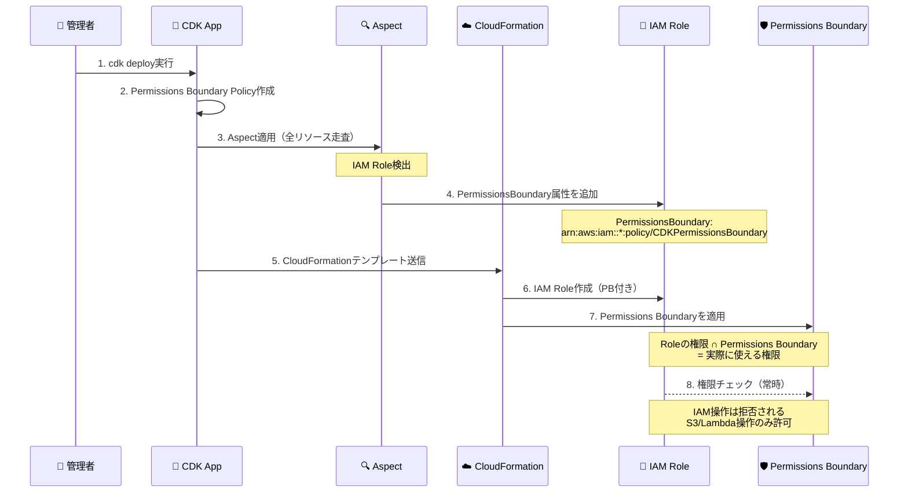
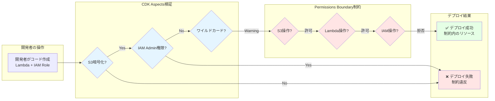

# セキュリティ機能の詳細説明

このドキュメントでは、実装された4つのセキュリティ機能について詳しく説明します。

## 🏗️ AWS構成図

### 全体アーキテクチャ

```mermaid
graph TB
    Admin[👤 管理者<br/>Administrator]
    Dev[👨‍💻 開発者<br/>Developer]
    DevRole[⛑️ 開発者ロール<br/>Developer Role]
    
    subgraph "CDK Setup Stack"
        SetupStack[📦 CDK Setup Stack]
    end
    
    subgraph "Setup Stack リソース"
        SetupCfn[☁️ Setup CloudFormation]
        PBPolicy[🛡️ Permissions Boundary<br/>CDKPermissionsBoundary]
        DenyPolicy[⛔ Deny Policy<br/>CDKSecurityDenyPolicy]
    end
    
    subgraph "Bootstrap"
        Bootstrap[🔧 Bootstrap実行<br/>🏷️ Qualifier: pbdemo<br/>--custom-permissions-boundary]
    end
    
    subgraph "Bootstrap リソース"
        BootstrapCfn[☁️ Bootstrap CloudFormation<br/>🏷️ Qualifier: pbdemo]
        S3Assets[🪣 S3 Bucket<br/>🏷️ cdk-pbdemo-assets-*]
        ECRRepo[🐳 ECR Repository<br/>🏷️ cdk-pbdemo-container-*]
        DeployRole[⛑️ Deployment Action Role<br/>cdk-pbdemo-deploy-role]
        ExecRole[⛑️ CloudFormation Execution Role<br/>🛡️ Boundary制限あり<br/>cdk-pbdemo-cfn-exec-role]
    end
    
    subgraph "CDK App Stack"
        AppStack[📦 CDK App Stack]
        QualifierConfig[⚙️ cdk.json<br/>🏷️ Qualifier: pbdemo<br/>🛡️ Boundary: CDKPermissionsBoundary]
        Aspects[🔍 CDK Aspects]
    end
    
    subgraph "AWSリソース"
        AppCfn[☁️ App CloudFormation]
        Lambda[⚡ Lambda Function]
        LambdaRole[⛑️ Lambda IAM Role<br/>🛡️ Boundary制限あり]
        S3Bucket[🪣 S3 Bucket<br/>暗号化・バージョニング]
        CustomRole[⛑️ Custom IAM Role<br/>🛡️ Boundary制限あり]
    end
    
    subgraph Legend[" 凡例 "]
        LegendAdmin[■ 管理者が作成]
        LegendDev[■ 開発者が作成]
    end
    
    Dev -.assume.-> DevRole
    DevRole -.assume.-> DeployRole
    
    Admin -->|1. Setup Stack| SetupStack
    SetupStack -->|デプロイ| SetupCfn
    SetupCfn --> PBPolicy
    SetupCfn --> DenyPolicy
    
    Admin -->|2. Bootstrap<br/>開発者は実行不可| Bootstrap
    Bootstrap -->|デプロイ| BootstrapCfn
    BootstrapCfn --> S3Assets
    BootstrapCfn --> ECRRepo
    BootstrapCfn --> DeployRole
    BootstrapCfn --> ExecRole
    
    Dev -->|3. Qualifier設定| QualifierConfig
    QualifierConfig -.🏷️指定.-> BootstrapCfn
    DeployRole -->|4. スタック開発| AppStack
    AppStack -.参照.-> QualifierConfig
    AppStack -->|実行| AppCfn
    AppStack -.PassRole.-> ExecRole
    AppStack -.検証.-> Aspects
    
    AppCfn --> Lambda
    AppCfn --> LambdaRole
    AppCfn --> S3Bucket
    AppCfn --> CustomRole
    AppCfn -.参照.-> S3Assets
    AppCfn -.参照.-> ECRRepo
    AppCfn -.参照.-> DeployRole
    AppCfn -.参照.-> ExecRole
    
    Lambda --> LambdaRole
    Lambda -.アクセス.-> S3Bucket
    
    style Admin fill:#FFFFFF
    style Dev fill:#FFFFFF
    style DevRole fill:#FFFFFF
    style SetupStack fill:#FFE5E5
    style SetupCfn fill:#FFE5E5
    style PBPolicy fill:#FFE5E5
    style DenyPolicy fill:#FFE5E5
    style Bootstrap fill:#FFE5E5
    style BootstrapCfn fill:#FFE5E5
    style S3Assets fill:#FFE5E5
    style ECRRepo fill:#FFE5E5
    style DeployRole fill:#FFE5E5
    style ExecRole fill:#FFE5E5
    style AppStack fill:#E5F5FF
    style AppCfn fill:#E5F5FF
    style QualifierConfig fill:#E5F5FF
    style Aspects fill:#E5F5FF
    style Lambda fill:#E5F5FF
    style LambdaRole fill:#E5F5FF
    style S3Bucket fill:#E5F5FF
    style CustomRole fill:#E5F5FF
    style LegendAdmin fill:#FFE5E5
    style LegendDev fill:#E5F5FF
    style Legend fill:#F5F5F5
```

### ロールと制限の説明

| ロール | 実行可能な操作 | 制限 | 目的 |
|--------|--------------|------|------|
| **Deployment Action Role** | ✅ CDKアプリ開発<br/>✅ CloudFormation実行依頼<br/>✅ cdk.json設定 | ❌ Bootstrap実行不可<br/>❌ IAM操作制限 | アプリケーション開発とデプロイ依頼（Permissions Boundary適用なし） |
| **CloudFormation Execution Role** | ✅ CloudFormation経由のリソース作成<br/>✅ Permissions Boundary内のIAM操作 | 🛡️ Permissions Boundary制限<br/>❌ Permissions Boundary変更不可<br/>❌ Boundary外の操作不可 | CloudFormationによる実際のリソース作成 |

### セットアップフロー

1. **管理者が実行する初期セットアップ**
   ```bash
   # Step 1: Setup Stackをデプロイ（Permissions BoundaryとDeny Policy作成）
   cd cdk-setup
   cdk deploy
   
   # Step 2: Bootstrapを実行（Qualifier指定）
   cdk bootstrap --qualifier pbdemo \
     --toolkit-stack-name CDKToolkit-pbdemo \
     aws://ACCOUNT_ID/REGION
   ```

2. **開発者が実行するアプリ開発**
   ```bash
   # Step 3: cdk.jsonにQualifierを設定
   # "@aws-cdk/core:bootstrapQualifier": "pbdemo"
   
   # Step 4: アプリケーションをデプロイ
   cd cdk-app
   cdk deploy
   # ※ 開発者はBootstrapを実行できません
   ```

### IAM Role Boundary継承フロー



### リソース作成時の制約チェック



### セキュリティレイヤーの詳細

```
┌─────────────────────────────────────────────────────────────┐
│ Layer 1: CDK Aspects（デプロイ前チェック）                   │
│ 実行者: CDK CLI（開発者が cdk deploy 実行時）                 │
├─────────────────────────────────────────────────────────────┤
│ ✓ IAMロール検証（AdministratorAccess禁止）                    │
│ ✓ S3セキュリティ検証（暗号化・バージョニング・パブリック）    │
│ ✓ ワイルドカード権限の警告                                    │
│ → 不合格の場合: デプロイ中断                                  │
└─────────────────────────────────────────────────────────────┘
                           ↓ デプロイ実行
┌─────────────────────────────────────────────────────────────┐
│ Layer 2: Qualifier（環境分離）                               │
│ 設定者: 管理者（cdk.jsonに設定）                              │
├─────────────────────────────────────────────────────────────┤
│ ✓ カスタムQualifier "pbdemo" を使用                          │
│ ✓ Bootstrap環境を物理的に分離                                │
│ ✓ 環境ごとに異なるS3/ECR/IAMリソース                         │
│ → 環境間の干渉を防止                                         │
└─────────────────────────────────────────────────────────────┘
                           ↓ リソース作成
┌─────────────────────────────────────────────────────────────┐
│ Layer 3: Permissions Boundary（権限の上限）                  │
│ 作成者: 管理者（初回デプロイ時に作成）                        │
│ 適用者: CDK Aspects（全IAMロールに自動適用）                  │
├─────────────────────────────────────────────────────────────┤
│ 許可: S3, Lambda, CloudWatch Logs, DynamoDB                  │
│ 拒否: IAM操作（CreatePolicy, AttachRolePolicy等）            │
│ → 過度な権限付与を防止                                       │
└─────────────────────────────────────────────────────────────┘
                           ↓ 実行時
┌─────────────────────────────────────────────────────────────┐
│ Layer 4: IAM Deny Policy（脱獄防止）                         │
│ 作成者: 管理者（初回デプロイ時に作成）                        │
│ 適用者: 開発者（必要なRoleにアタッチ）                        │
├─────────────────────────────────────────────────────────────┤
│ ✓ Permissions Boundaryの削除・変更を拒否                     │
│ ✓ セキュリティポリシーの変更を拒否                           │
│ ✓ セキュリティグループの全開放(0.0.0.0/0)を拒否             │
│ → 権限昇格（脱獄）を防止                                     │
└─────────────────────────────────────────────────────────────┘
```

## 実装ファイルへのリンク

### セットアップスタック（管理者が作成）

- **[Setup Stack](../cdk-setup/lib/cdk-setup-stack.ts)** - Permissions BoundaryとDeny Policyの作成
- **[Setup Entry](../cdk-setup/bin/cdk-setup.ts)** - セットアップスタックのエントリーポイント

### アプリケーションスタック（開発者が作成）

- **[Permissions Boundary](lib/permissions-boundary-policy.ts)** - 権限の上限設定（参照用）
- **[Deny Policy](lib/deny-policy.ts)** - 脱獄防止ポリシー（参照用）
- **[Security Aspects](lib/security-aspects.ts)** - 設定検証Aspects
- **[Main Stack](lib/cdk-app-stack.ts)** - サンプルスタック
- **[App Entry](bin/cdk-app.ts)** - Aspects適用

### セットアップフロー詳細

1. **管理者: cdk-setupスタックをデプロイ**
   - Permissions Boundary作成
   - Deny Policy作成
   - ARNをエクスポート

2. **管理者: Bootstrapを実行（Qualifier指定）**
   - `--qualifier pbdemo` を指定
   - 開発者はこの操作を実行できない

3. **開発者: cdk-appスタックをデプロイ**
   - cdk.jsonでQualifierを参照
   - cdk-setupで作成したポリシーを参照
   - Aspectsでセキュリティチェック

## 1. Qualifier による環境分離

### 概要
Qualifierは、CDKのブートストラップリソースに付けられる識別子です。これにより、同じAWSアカウント内で複数の独立した環境を構築できます。

**設定者**: 管理者（cdk.jsonに設定、Bootstrapを実行）  
**制限**: 開発者はBootstrapを実行できません

### 設定方法

#### cdk.json での設定

**ファイル**: [`cdk.json`](cdk.json)

```json
{
  "context": {
    "@aws-cdk/core:bootstrapQualifier": "pbdemo"
  }
}
```

#### ブートストラップコマンド（管理者が実行）

```bash
cdk bootstrap \
  --qualifier pbdemo \
  --toolkit-stack-name CDKToolkit-pbdemo \
  aws://123456789012/us-east-1
```

### 作成されるリソース

| リソースタイプ | デフォルト名 | カスタムQualifier名 | 作成者 |
|--------------|------------|-------------------|--------|
| S3バケット | cdk-hnb659fds-assets-{account}-{region} | cdk-**pbdemo**-assets-{account}-{region} | 管理者 |
| ECRリポジトリ | cdk-hnb659fds-container-assets-{account}-{region} | cdk-**pbdemo**-container-assets-{account}-{region} | 管理者 |
| IAMロール（デプロイ用） | cdk-hnb659fds-deploy-role-{account}-{region} | cdk-**pbdemo**-deploy-role-{account}-{region} | 管理者 |
| IAMロール（実行用） | cdk-hnb659fds-cfn-exec-role-{account}-{region} | cdk-**pbdemo**-cfn-exec-role-{account}-{region} | 管理者 |

### 利用シーン

#### シーン1: 環境ごとの分離
```
開発環境: Qualifier = "dev"    → cdk-dev-assets-...
検証環境: Qualifier = "stg"    → cdk-stg-assets-...
本番環境: Qualifier = "prod"   → cdk-prod-assets-...
```

#### シーン2: チームごとの分離
```
チームA: Qualifier = "teama"   → cdk-teama-assets-...
チームB: Qualifier = "teamb"   → cdk-teamb-assets-...
```

#### シーン3: プロジェクトごとの分離
```
プロジェクト1: Qualifier = "proj1"  → cdk-proj1-assets-...
プロジェクト2: Qualifier = "proj2"  → cdk-proj2-assets-...
```

### メリット

1. **リソースの衝突回避**: 複数の環境やチームが同じアカウントを使用しても、リソース名が衝突しない
2. **明確な権限分離**: 環境ごとに異なるIAMロールを使用可能
3. **独立したライフサイクル**: 各環境を独立して管理・削除可能

## 2. Permissions Boundary による権限制限

### 概要
Permissions Boundaryは、IAMロールやユーザーが持つことができる権限の上限を定義します。どんな権限を付与しても、Permissions Boundaryで許可されていない操作は実行できません。

**作成者**: 管理者（初回スタックデプロイ時に自動作成）  
**適用者**: CDK Aspects（全IAMロールに自動適用）

### 実装ファイル

**[`lib/permissions-boundary-policy.ts`](lib/permissions-boundary-policy.ts)** - Permissions Boundaryポリシーの定義

### 実装例

```typescript
// lib/permissions-boundary-policy.ts より抜粋
const permissionsBoundary = new iam.ManagedPolicy(this, 'PermissionsBoundary', {
  managedPolicyName: 'CDKPermissionsBoundary',
  statements: [
    // 許可する操作（ホワイトリスト）
    new iam.PolicyStatement({
      effect: iam.Effect.ALLOW,
      actions: [
        's3:GetObject',
        's3:PutObject',
        'lambda:InvokeFunction',
        'logs:CreateLogGroup',
        'logs:PutLogEvents',
      ],
      resources: ['*'],
    }),
    // 明示的に拒否する操作（IAM変更の防止）
    new iam.PolicyStatement({
      effect: iam.Effect.DENY,
      actions: [
        'iam:CreatePolicy',
        'iam:AttachRolePolicy',
        'iam:PutRolePermissionsBoundary',
      ],
      resources: ['*'],
    }),
  ],
});
```

完全な実装は [`lib/permissions-boundary-policy.ts`](lib/permissions-boundary-policy.ts) を参照してください。

### Aspectsによる自動適用

**[`lib/security-aspects.ts`](lib/security-aspects.ts)** - PermissionsBoundaryAspectの実装

```typescript
// lib/security-aspects.ts より抜粋
export class PermissionsBoundaryAspect implements cdk.IAspect {
  constructor(private readonly permissionsBoundaryArn: string) {}

  public visit(node: IConstruct): void {
    if (node instanceof iam.Role) {
      const cfnRole = node.node.defaultChild as iam.CfnRole;
      cfnRole.permissionsBoundary = this.permissionsBoundaryArn;
    }
  }
}
```

**[`bin/cdk-app.ts`](bin/cdk-app.ts)** - Aspectsの適用

```typescript
// bin/cdk-app.ts より抜粋
const permissionsBoundaryArn = process.env.PERMISSIONS_BOUNDARY_ARN || 
  `arn:aws:iam::${process.env.CDK_DEFAULT_ACCOUNT}:policy/CDKPermissionsBoundary`;

cdk.Aspects.of(stack).add(new PermissionsBoundaryAspect(permissionsBoundaryArn));
```
```

### 権限の組み合わせ例

#### 例1: S3への読み取り権限

```typescript
// IAMロールに付与された権限
role.addToPolicy(new iam.PolicyStatement({
  effect: iam.Effect.ALLOW,
  actions: ['s3:GetObject', 's3:DeleteObject'],
  resources: ['arn:aws:s3:::my-bucket/*'],
}));

// Permissions Boundaryで許可された権限
// - s3:GetObject ✓
// - s3:PutObject ✓
// - s3:DeleteObject ✓

// 実際に実行可能な操作
// - s3:GetObject ✓ (ロールとBoundary両方で許可)
// - s3:DeleteObject ✓ (ロールとBoundary両方で許可)
```

#### 例2: IAM操作の拒否

```typescript
// IAMロールに管理者権限を付与しようとしても...
role.addManagedPolicy(
  iam.ManagedPolicy.fromAwsManagedPolicyName('AdministratorAccess')
);

// Permissions BoundaryでIAM操作が拒否されているため
// IAM操作は実行不可 ❌
// - iam:CreatePolicy → 拒否
// - iam:AttachRolePolicy → 拒否
// - iam:CreateUser → 拒否
```

### 効果的な権限設定パターン

#### パターン1: サービス単位での制限
```typescript
// Lambda関数用のPermissions Boundary
statements: [
  new iam.PolicyStatement({
    effect: iam.Effect.ALLOW,
    actions: [
      'lambda:*',
      's3:GetObject',
      's3:PutObject',
      'dynamodb:GetItem',
      'dynamodb:PutItem',
      'logs:*',
    ],
    resources: ['*'],
  }),
]
```

#### パターン2: リソース範囲での制限
```typescript
// 特定のリソースのみ許可
statements: [
  new iam.PolicyStatement({
    effect: iam.Effect.ALLOW,
    actions: ['s3:*'],
    resources: [
      'arn:aws:s3:::allowed-bucket-prefix-*',
      'arn:aws:s3:::allowed-bucket-prefix-*/*',
    ],
  }),
]
```

#### パターン3: 条件付きアクセス
```typescript
// 特定のVPCからのみ許可
statements: [
  new iam.PolicyStatement({
    effect: iam.Effect.ALLOW,
    actions: ['ec2:*'],
    resources: ['*'],
    conditions: {
      StringEquals: {
        'ec2:Vpc': 'vpc-12345678',
      },
    },
  }),
]
```

## 3. IAM Deny Policy による脱獄防止

### 概要
IAM Denyポリシーは、明示的な拒否ルールを定義し、Permissions Boundary自体の変更や削除を防ぎます。これにより「脱獄」（権限制限の回避）を防止します。

**作成者**: 管理者（初回スタックデプロイ時に自動作成）  
**適用者**: 開発者（必要なIAMロールにアタッチ）

### 実装ファイル

**[`lib/deny-policy.ts`](lib/deny-policy.ts)** - Deny Policyの定義

### 実装例

```typescript
// lib/deny-policy.ts より抜粋
const denyPolicy = new iam.ManagedPolicy(this, 'SecurityDenyPolicy', {
  managedPolicyName: 'CDKSecurityDenyPolicy',
  statements: [
    // Permissions Boundaryの変更・削除を拒否
    new iam.PolicyStatement({
      effect: iam.Effect.DENY,
      actions: [
        'iam:DeleteRolePermissionsBoundary',
        'iam:PutRolePermissionsBoundary',
      ],
      resources: ['*'],
      conditions: {
        StringNotEquals: {
          'aws:PrincipalArn': 'arn:aws:iam::*:role/AdminRole',
        },
      },
    }),
    // セキュリティポリシーの変更を拒否
    new iam.PolicyStatement({
      effect: iam.Effect.DENY,
      actions: [
        'iam:DeletePolicy',
        'iam:CreatePolicyVersion',
      ],
      resources: [
        'arn:aws:iam::*:policy/CDKPermissionsBoundary',
        'arn:aws:iam::*:policy/CDKSecurityDenyPolicy',
      ],
    }),
  ],
});
```

### 防止される攻撃パターン

#### パターン1: Permissions Boundaryの削除
```bash
# 悪意あるユーザーが試みること
aws iam delete-role-permissions-boundary --role-name MyRole

# 結果: Deny Policyにより拒否される ❌
# Error: User is not authorized to perform: iam:DeleteRolePermissionsBoundary
```

#### パターン2: Permissions Boundaryの変更
```bash
# より緩いPermissions Boundaryに変更しようとする
aws iam put-role-permissions-boundary \
  --role-name MyRole \
  --permissions-boundary arn:aws:iam::123456789012:policy/WeakBoundary

# 結果: Deny Policyにより拒否される ❌
```

#### パターン3: セキュリティポリシーの削除
```bash
# セキュリティポリシー自体を削除しようとする
aws iam delete-policy \
  --policy-arn arn:aws:iam::123456789012:policy/CDKSecurityDenyPolicy

# 結果: Deny Policyにより拒否される ❌
```

#### パターン4: セキュリティグループの全開放
```bash
# 0.0.0.0/0 からのアクセスを許可しようとする
aws ec2 authorize-security-group-ingress \
  --group-id sg-12345678 \
  --protocol tcp \
  --port 22 \
  --cidr 0.0.0.0/0

# 結果: Deny Policyにより拒否される ❌
```

### 例外設定（管理者のみ許可）

```typescript
conditions: {
  StringNotEquals: {
    'aws:PrincipalArn': 'arn:aws:iam::*:role/AdminRole',
  },
}
```

管理者ロール（AdminRole）のみが、セキュリティ設定を変更できます。

## 4. CDK Aspects による設定検証

### 概要
CDK Aspectsは、スタック内のすべてのリソースを走査し、設定ミスやセキュリティ問題を自動検出します。

**実行者**: CDK CLI（開発者が `cdk deploy` 実行時）  
**検証タイミング**: デプロイ前（CloudFormationテンプレート生成時）

### 実装ファイル

**[`lib/security-aspects.ts`](lib/security-aspects.ts)** - 3つのAspectsクラスを定義

### 実装例

#### IAMロールの検証

**[`lib/security-aspects.ts`](lib/security-aspects.ts)** より抜粋

```typescript
// lib/security-aspects.ts より抜粋
export class IamRoleValidationAspect implements cdk.IAspect {
  public visit(node: IConstruct): void {
    if (node instanceof iam.Role) {
      // AdministratorAccessの使用をチェック
      const cfnRole = node.node.defaultChild as iam.CfnRole;
      if (cfnRole.managedPolicyArns) {
        cfnRole.managedPolicyArns.forEach((arn) => {
          if (arn.includes('AdministratorAccess')) {
            cdk.Annotations.of(node).addError(
              '❌ AdministratorAccessポリシーは使用禁止です'
            );
          }
        });
      }
      
      // ワイルドカードアクションの使用を警告
      if (cfnRole.policies) {
        cfnRole.policies.forEach((policy) => {
          if (policy.policyDocument.Statement.some(s => s.Action === '*')) {
            cdk.Annotations.of(node).addWarning(
              '⚠️ ワイルドカードアクションの使用は推奨されません'
            );
          }
        });
      }
    }
  }
}
```

#### S3セキュリティの検証

**[`lib/security-aspects.ts`](lib/security-aspects.ts)** より抜粋

```typescript
export class S3SecurityAspect implements cdk.IAspect {
  public visit(node: IConstruct): void {
    if (node instanceof s3.CfnBucket) {
      // 暗号化チェック
      if (!node.bucketEncryption) {
        cdk.Annotations.of(node).addError(
          '❌ S3バケットの暗号化が必須です'
        );
      }
      
      // バージョニングチェック
      if (!node.versioningConfiguration?.status) {
        cdk.Annotations.of(node).addWarning(
          '⚠️ バージョニングの有効化を推奨します'
        );
      }
      
      // パブリックアクセスブロックチェック
      if (!node.publicAccessBlockConfiguration) {
        cdk.Annotations.of(node).addError(
          '❌ パブリックアクセスブロックが必須です'
        );
      }
    }
  }
}
```

### 検証結果の例

#### 良い例（エラーなし）
```typescript
const bucket = new s3.Bucket(this, 'SecureBucket', {
  encryption: s3.BucketEncryption.S3_MANAGED,  // ✓
  versioned: true,                              // ✓
  blockPublicAccess: s3.BlockPublicAccess.BLOCK_ALL,  // ✓
});

// cdk synth の結果: エラーなし ✓
```

#### 悪い例（エラーあり）
```typescript
const bucket = new s3.Bucket(this, 'InsecureBucket', {
  // 暗号化なし                                 // ❌
  // バージョニングなし                          // ⚠️
  // パブリックアクセスブロックなし               // ❌
});

// cdk synth の結果:
// ❌ Error: S3バケットの暗号化が必須です
// ⚠️ Warning: バージョニングの有効化を推奨します
// ❌ Error: パブリックアクセスブロックが必須です
```

### カスタムAspectsの作成

独自の検証ルールを追加できます：

```typescript
// カスタムタグの検証
export class TagValidationAspect implements cdk.IAspect {
  public visit(node: IConstruct): void {
    if (cdk.TagManager.isTaggable(node)) {
      const tags = cdk.TagManager.of(node).tagValues();
      
      // 必須タグのチェック
      if (!tags['Environment']) {
        cdk.Annotations.of(node).addError(
          '❌ Environmentタグが必須です'
        );
      }
      
      if (!tags['Owner']) {
        cdk.Annotations.of(node).addWarning(
          '⚠️ Ownerタグの設定を推奨します'
        );
      }
    }
  }
}

// Aspectの適用
cdk.Aspects.of(app).add(new TagValidationAspect());
```

### Aspectsの適用方法

**[`bin/cdk-app.ts`](bin/cdk-app.ts)** - Aspectsの適用

```typescript
// bin/cdk-app.ts より抜粋
// すべてのIAMロールにPermissions Boundaryを適用
cdk.Aspects.of(stack).add(new PermissionsBoundaryAspect(permissionsBoundaryArn));

// IAMロール検証Aspectの適用
cdk.Aspects.of(stack).add(new IamRoleValidationAspect());

// S3セキュリティ検証Aspectの適用
cdk.Aspects.of(stack).add(new S3SecurityAspect());
```

### 検証結果の例

実際のスタック実装は **[`lib/cdk-app-stack.ts`](lib/cdk-app-stack.ts)** を参照してください。

#### 良い例（エラーなし）

**[`lib/cdk-app-stack.ts`](lib/cdk-app-stack.ts)** より抜粋

```typescript
const bucket = new s3.Bucket(this, 'SecureBucket', {
  encryption: s3.BucketEncryption.S3_MANAGED,  // ✓
  versioned: true,                              // ✓
  blockPublicAccess: s3.BlockPublicAccess.BLOCK_ALL,  // ✓
});

// cdk synth の結果: エラーなし ✓
```

## セキュリティレイヤーの組み合わせ

4つの機能を組み合わせることで、多層防御を実現します：

```
リクエスト
    ↓
┌─────────────────────────────────────┐
│ Layer 1: CDK Aspects                │
│ デプロイ前に設定ミスを検出           │
│ → 不適切な設定をブロック             │
└─────────────────────────────────────┘
    ↓ デプロイ
┌─────────────────────────────────────┐
│ Layer 2: Qualifier                  │
│ 環境を物理的に分離                   │
│ → 環境間の干渉を防止                 │
└─────────────────────────────────────┘
    ↓ 実行時
┌─────────────────────────────────────┐
│ Layer 3: Permissions Boundary       │
│ 実行可能な操作の上限を設定           │
│ → 過度な権限付与を防止               │
└─────────────────────────────────────┘
    ↓
┌─────────────────────────────────────┐
│ Layer 4: IAM Deny Policy            │
│ セキュリティ設定の変更を拒否         │
│ → 権限昇格（脱獄）を防止             │
└─────────────────────────────────────┘
    ↓
  実行
```

## まとめ

この実装により、以下のセキュリティ要件を満たします：

1. **環境分離**: Qualifierによる物理的な分離
2. **権限制限**: Permissions Boundaryによる上限設定
3. **変更防止**: IAM Denyによる脱獄防止
4. **設定検証**: CDK Aspectsによる自動検証

これらを適切に組み合わせることで、CDKを使用した安全なインフラ管理が可能になります。
